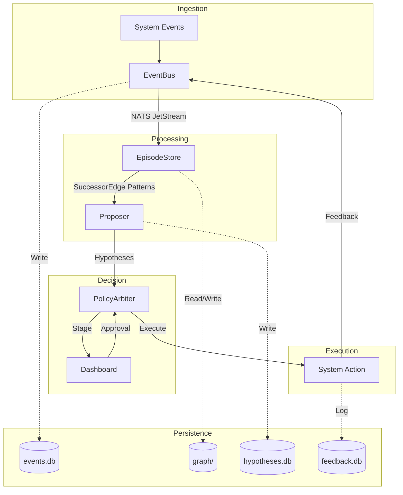

# CEREBELLUM Architecture

CEREBELLUM is an event-driven system designed to observe system activities, cluster them into meaningful episodes, and propose actions based on observed patterns. It operates as a closed-loop system where events lead to proposals, which are then filtered through a policy engine before execution.

## Dataflow Diagram

## Components

### EventBus
The EventBus acts as the central ingestion point for all system events. It persists every event to a SQLite database using Write-Ahead Logging (WAL) for high concurrency and publishes them to NATS JetStream for real-time downstream consumption. It also handles relaying events from external sources via NATS subscriptions.

### EpisodeStore
The EpisodeStore consumes the event stream and groups related events into temporal episodes based on time proximity. These episodes are stored in a KuzuDB graph database, which is used to identify SuccessorEdge patterns—statistical co-occurrences of events that suggest potential relationships. This component focuses on pattern recognition without claiming causal inference.

### Proposer
The Proposer analyzes identified patterns and current system state to generate hypotheses for potential actions. It interfaces with external Large Language Models via OpenRouter to draft detailed plans, including confidence scores, utility estimates, and projected costs. These hypotheses are stored in a dedicated SQLite database for tracking and evaluation.

### PolicyArbiter
The PolicyArbiter evaluates proposed hypotheses against a set of YAML-defined policies. It categorizes proposals into three tiers: automatic execution, staging for manual approval, or immediate discard. It includes safety features such as a file-lock based kill-switch and protection against Server-Side Request Forgery (SSRF) for network-bound actions.

### Dashboard
The Dashboard provides a real-time interface for monitoring the event stream and managing proposed hypotheses. Built with FastAPI and HTMX, it allows users to approve or reject staged proposals and integrates with Telegram for remote notifications and decision-making. It serves as the primary human-in-the-loop interface for the system.

## Persistence Layer

- **events.db (SQLite WAL)**: A persistent store for the raw history of all ingested events, optimized for high-frequency writes.
- **hypotheses.db (SQLite)**: A database containing all generated proposals, their metadata, and their current lifecycle status.
- **graph/ (KuzuDB)**: A graph database that maintains the structure of events, episodes, and their statistical co-occurrence patterns.
- **feedback.db (SQLite)**: A storage layer for recording the outcomes and feedback from executed proposals to inform future system behavior.
- **NATS JetStream**: A distributed messaging system used for reliable, real-time event streaming between components.

## Configuration

- **config.json**: The primary configuration file containing system-level settings, API credentials for OpenRouter, and connection parameters for NATS.
- **policy.yaml**: A YAML-based policy engine configuration that defines the rules, thresholds, and safety constraints used by the PolicyArbiter.

## Data Flow

The system follows a linear data flow from observation to action:
1. **Events**: Raw data points are ingested by the EventBus and persisted.
2. **Episodes**: The EpisodeStore clusters these events into temporal windows.
3. **SuccessorEdge Patterns**: Statistical co-occurrence patterns are mined from the episode graph.
4. **Proposals**: The Proposer uses these patterns to generate Hypothesis objects via LLM calls.
5. **Arbiter Decisions**: The PolicyArbiter filters proposals based on safety and utility policies.
6. **Execution**: Approved proposals are executed, and their results are recorded as feedback.
